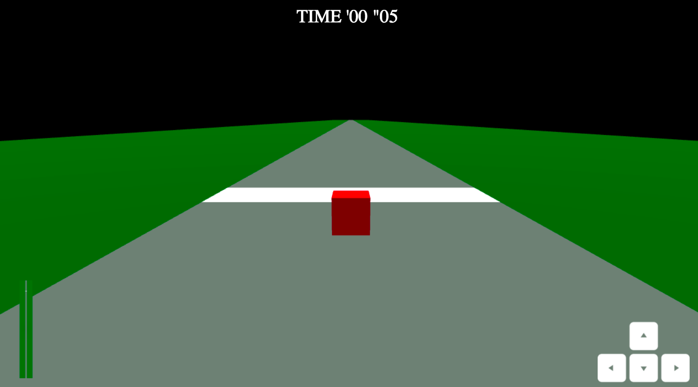

# Racecube

-----------------------------
## Technologies Used

### Front-end: 
* Three.js (based on WebGL)
* Physijs engine for three.js
* EJS
* HTML 
* CSS
* JavaScript
* JQuery 

### Routing: 
* Ajax
* Express

### Back-end: 
* Node.js
* Sequelize
* Postgres SQL

-----------------------------
## The General Approach

* Experimental, really bare bones just to start
* Talked to Alex Creighton and Mark Klein from previous WDI cohorts, asked them for resources
* Did some demos and fork and clone some existing repos to practice (three.js and physijs)
* Figured out how to architect the three.js app using Node

-----------------------------
## Installation instructions

### To play now
https://racecube.herokuapp.com/

### To fork and clone from GitHub and run locally

* fork and clone from Github
* cd into the code and npm install at the package.json level
in Terminal:
* type "node back-end/db/dbSetup.js"
* type "node back-end/db.seed.js"
* type "nodemon server.js"
* open up http://localhost:3000 in your browser

-----------------------------
## User Stories

* [Trello](https://trello.com/b/K5HMDpnF/project-4)

-----------------------------
## Todo List

- [ ] A user will be able to enter their name before they play so their scores are saved to them
- [ ] A user will see and hear great styling, graphics and audio
- [ ] A user will be able to play against a second racecube
- [ ] A user will be able to choose a different racetrack
- [ ] A user will be able to go around curves on the racetrack
- [ ] A user will earn extra powers by running into question mark diamonds
- [ ] A user will be able to choose a different character